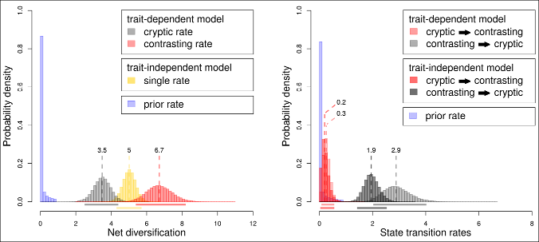

Color pattern evolution in Dipsadidae snakes
=========================

R code for the article "Daniel S. Caetano, Laura R.V. Alencar, Paulo Passos, Marcio Martins, Felipe G. Grazziotin, & Hussam Zaher. The colors of deception: Evolution of warning signals in Neotropical snakes (Colubroidea: Dipsadidae)" To be submitted to Evolution.

Here are all the data and scripts necessary to reproduce all the analyses and figures. Each script is self explanatory. However the following order is recommended for a better understanding of the steps applied to the analyses.

Note that some of the analyses and simulations take a long time to run. In those cases we present the code in a commented form immediately preceeded by a warning. The user can easily skip blocks of commented code with such analyses and load the results instead of running the simulations again.

Run the scripts in the following order:

 - **data_preparation.R**
 
 Prepares all the data for the analyses.
 - **BiSSE_analyses.R**
 
 Makes all analyses. Including the main categorization and the three alternative definitions for the coloration patterns.
 
 - **model_selection_and_posterior_predictive_check.R**
 
 Makes the model selection for all the MCMC results using Deviance Information Criteria (DIC). Also make posterior predictive checks to test the adequacy of the model to the empirical data.
 
 - **medusa_analyses.R**
 
 Performs MEDUSA analyses across the 100 phylogenies sampled from the posterior distribution of a Beast 1.8 phylogeny estimation with a concatenated dataset.
 
 - **BiSSE_null_model_simulations.R**
 
 Performs Likelihood Ratio Test (LRT) simulations under the BiSSE null model following Rabosky and Goldberg, 2015.
 - **make_figures.R**
 
 Produces all the figures reported in the manucript.
